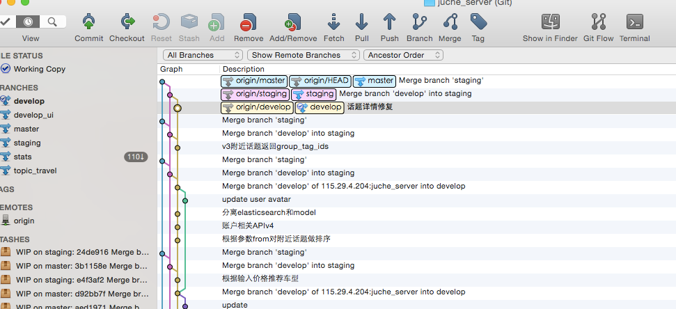
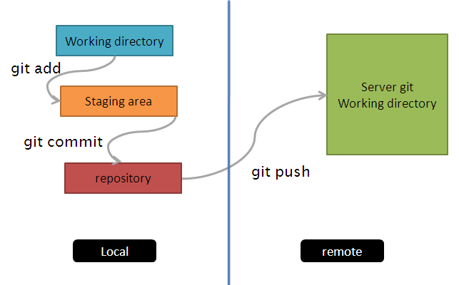
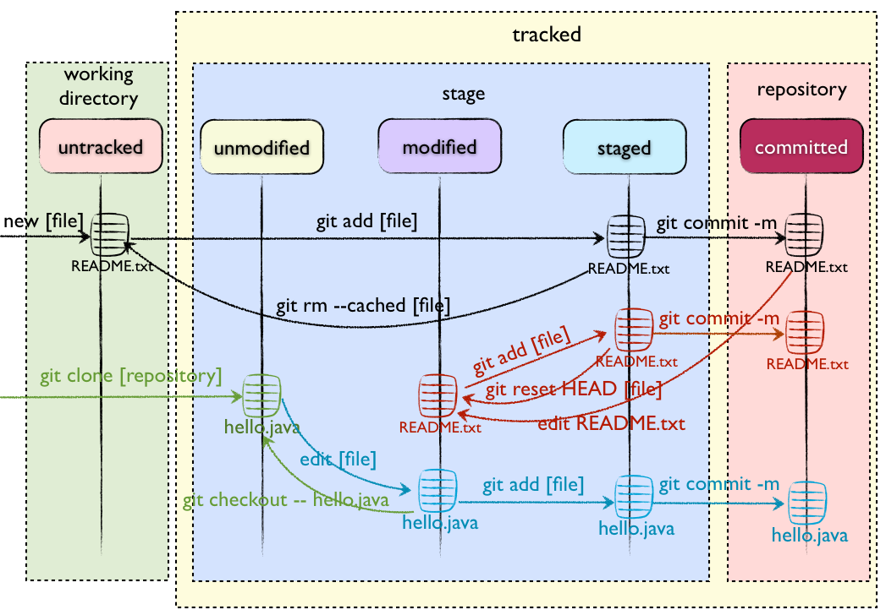
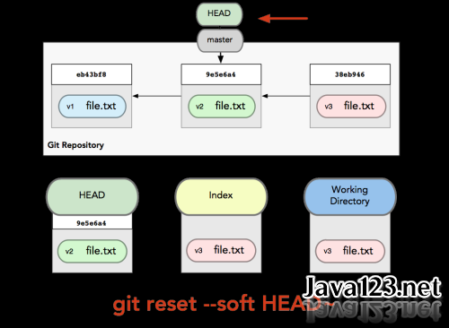
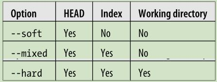
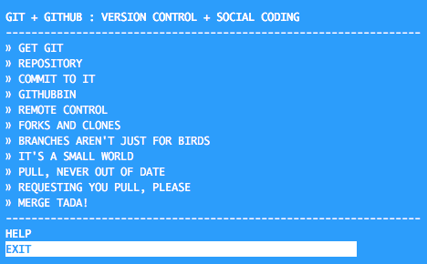

# Git入门 #


	源代码管理的最佳选择

# 闲扯 #


# Git命令 #

	30多个命令 


	
# 入门 #

* git branch
* git status
* git add <file>
* git commit -m "message"
* git push origin master
* git remote add origin <server>
* git clone <server>
* git init 

# 基础 #

* git pull origin master
* git merge develop
* git checkout
* git reset HEAD^
* git log --graph --oneline
* git tag
* git stash
* git fetch origin master

# 高级 #

啥？

# 入门 #



* git branch -a
* git status
* git add <file>
* git commit -m "message"
* git push origin master

# 分支 #

	git branch -a
	


# 文件状态 #
	
	git status

* untracked 未追踪
* unmodified 未修改
* modified 已修改
* staged 



# 入门实践 # 


# 入门实践 # 

* 添加 

	```
	 git add <filename>
	 git add *	
	```
 
* 提交 
	
	```
	git commit -m "代码提交信息"	
	```
	
* 推送改动

	除非你将分支推送到远端仓库，不然该分支就是 不为他人所见的：
	
	```
	git push origin <branch>
	```
	
	如果还没有克隆现有仓库，并欲将你的仓库连接到某个远程服务器，使用如下命令添加：

	```
 	git remote add origin <server>
 	```

# 新建本地仓库 #

* 复制远端仓库到本地

	``` 
	git clone <server>
	```

* 为已有代码新建仓库

	```	
	git init
	```
	
# 分支 #

	删掉新建的分支：

	``` 
	git branch -d <branch>
	git push origin :<branch>
	```	
	
# 基础 ##

* git pull origin master
* git merge develop
* git checkout
* git reset HEAD^
* git log --graph --oneline

# HEAD #

* HEAD [ HEAD-3, HEAD^3 ]



# 基础实践 # 


 
# 更新与合并 #

```
git pull	
```
 
以在你的工作目录中 获取（fetch） 并 合并（merge） 远端的改动。 要合并其他分支到你的当前分支（例如 master），执行：

```
git fetch origin master
git merge <branch>	
```

git 会尝试去自动合并改动。不幸的是，自动合并并非次次都能成功，并可能导致 冲突（conflicts）。 这时候就需要你修改这些文件来人肉合并这些 冲突（conflicts） 

```
git diff <source_branch> <target_branch>
```
	
# 替换本地改动 #

* 假如你做错事（自然，这是不可能的），你可以使用如下命令替换掉本地改动：

```
git checkout -- <filename>	
```

此命令会使用 HEAD 中的最新内容替换掉你的工作目录中的文件。已添加到缓存区的改动，以及新文件，都不受影响。

* 创建一个叫做“feature_x”的分支，并切换过去：

```
git checkout -b feature_x	
```
 
* 切换回主分支：

```
git checkout master
```

# 丢弃本地改动与提交 #

假如你想要丢弃你所有的本地改动与提交，可以到服务器上获取最新的版本并将你本地主分支指向到它：

```
git reset [--soft] origin/master
git reset --hard origin/master	
```



# 查看提交日志 # 

```
git log --graph --oneline
```


# 储藏（Stashing） # 

放入stash

```
git stash
```

* git stash show
* git stash pop
* git stash list

# 标签 #

在软件发布时创建标签，是被推荐的。这是个旧有概念，在 SVN 中也有。可以执行如下命令以创建一个叫做 1.0.0 的标签：

```
git tag 1.0.0 <commit>
```

# 高级 #

超大型项目


# 实践 git-flow #


**5**个主分支

* master
* develop
* release
* hotfix
* feature


# 实践 juche_server #


**3**个主分支

* master 线上服务器
* staging 测试服务器
* develop ci服务器

# 内部结构 #


# 相关文件 #

* .gitignore
* .git/config
* HEAD
* index
* objects/
* refs/

# Git对象 #

* commit 
* tree 
* blob


# Git Reference #

[Git 内部原理](http://git.oschina.net/progit/9-Git-%E5%86%85%E9%83%A8%E5%8E%9F%E7%90%86.html#9.3-Git-References)

* **HEAD**
* **tags**
* **remotes**
* packfiles
* refspec


# 回顾-文件状态 #


# 回顾-入门 #


# 回顾-基础 #


# 回顾 # 


# 提问 #


# 参考资料 #

* 书籍pro-git
* git-it练习
* 速查表

# 书籍pro-git #

* [中文](http://git.oschina.net/progit/)
* [英文](http://git-scm.com/book/en/v2)


# git-it练习 #

* [git-it练习](https://github.com/jlord/git-it)



* [nodeschool](http://nodeschool.io/)

# 速查表 #

* 

# 中文速查表 #

* 

# 作业 #

* pro git
* git-it
* git rebase
* git revert
* git show
* git shortlog
* git blame
* git am

# 谢谢 #


